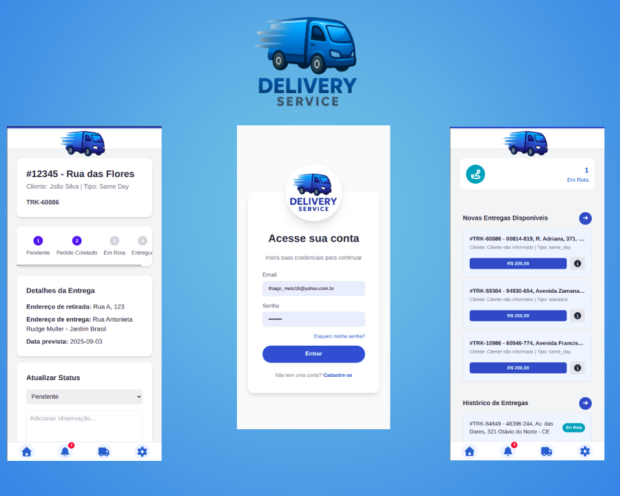
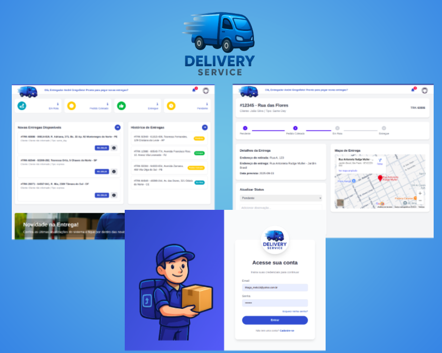

# 🚚 Sistema de Entregas - Microserviços

Este projeto é um **sistema de entregas (logística)** desenvolvido com arquitetura de **microserviços**, utilizando **Laravel 12**, **RabbitMQ** e **Docker**.  
O objetivo é simular um ambiente real de logística, incluindo cadastro de usuários, notificações e gerenciamento de entregas.

---
## 🖼️ Preview

Visualização das telas principais (Web e Mobile):

<p align="center">
  
  
</p>

---

## 📌 Visão Geral

O sistema foi dividido em microserviços independentes, com **frontend em Vue 3** consumindo APIs:

- **Frontend (Vue 3 + Composition API)** → Interface Web e Mobile responsiva, consumindo APIs autenticadas.  
- **User Service** → Gerencia autenticação via **JWT**, cadastro e recuperação de senha.  
- **Notification Service** → Consome filas para envio de e-mails e notificações.  
- **Delivery Service** → Gerencia entregas, status e rastreamento.  

Essa separação garante **escalabilidade, isolamento de falhas e facilidade de manutenção**.

---

## 🏗️ Arquitetura

```
┌──────────────┐      ┌───────────────────┐      ┌──────────────────┐
│ User Service │ ---> │ RabbitMQ (broker) │ ---> │ Notification Svc │
└──────────────┘      └───────────────────┘      └──────────────────┘
        │                        │
        │                        ▼
        │                 ┌──────────────┐
        └───────────────▶│ Delivery Svc │
                          └──────────────┘
```

📌 Comunicação assíncrona via filas:  
- `email.welcome` → disparada após cadastro de usuário.  
- `email.reset-password` → disparada ao solicitar redefinição de senha.  
- `delivery.status` → atualização de status de entregas.  

---

## ⚙️ Tecnologias

- **Autenticação:** JWT (User Service)  
- **Frontend:** Vue 3 + Composition API  
- **Backend:** Laravel 12 (User, Notification e Delivery Services)  
- **Mensageria:** RabbitMQ  
- **Containerização:** Docker & Docker Compose  
- **Testes de e-mail:** Mailhog  
- Banco de dados: MySQL / PostgreSQL   

---

## 🚀 Como Rodar o Projeto

1. Clone o repositório:
   ```bash
   git clone https://github.com/seu-usuario/sistema-entregas.git
   cd sistema-entregas
   ```

2. Suba os containers:
   ```bash
   docker-compose up -d
   ```

3. Acesse os serviços:
   - **User Service API** → [http://localhost:8001](http://localhost:8001)  
   - **Notification Service API** → [http://localhost:8002](http://localhost:8002)  
   - **Delivery Service API** → [http://localhost:8003](http://localhost:8003)  
   - **RabbitMQ Management** → [http://localhost:15672](http://localhost:15672)  
   - **Mailhog** → [http://localhost:8025](http://localhost:8025)  

---

## ✅ Próximos Passos

- [ ] Melhorar rastreamento de entregas no **Delivery Service**  
- [ ] Criar fila para **notificação por SMS**  
- [ ] Adicionar testes automatizados E2E  

---

## 👨‍💻 Autor

Desenvolvido por **Thiago Melo**  
- 💼 [LinkedIn](https://www.linkedin.com/in/thiago-web-10) 

---
